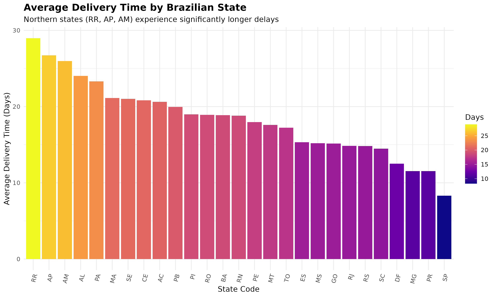
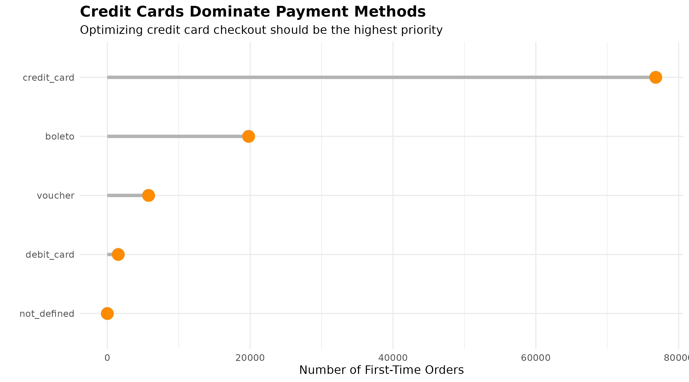
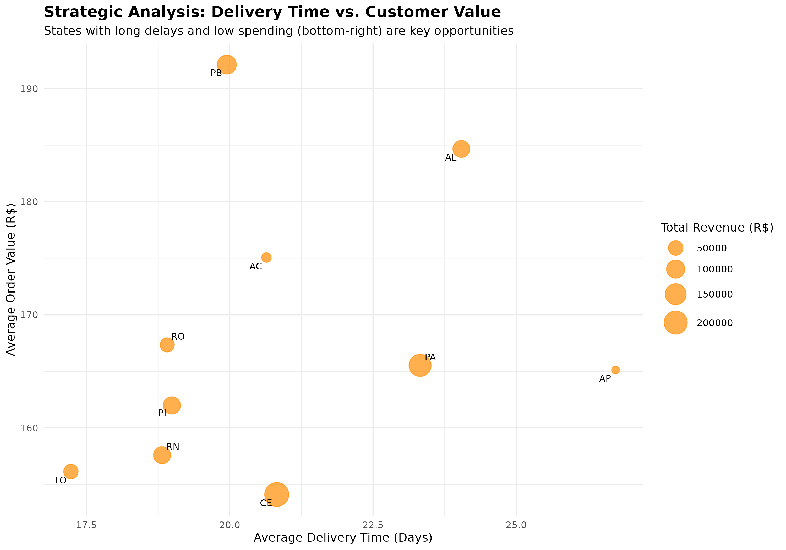

# Brazilian E-Commerce: First-Time Customer Analysis

## 📊 Business Problem
Olist, a Brazilian e-commerce platform, aims to improve the efficiency and profitability of its customer acquisition strategy. This project analyzes the behavior of first-time customers to identify key opportunities for growth and retention.

## 🛠️ Tools & Technologies
- **Data Processing & Analysis:** SQL (Google BigQuery)
- **Data Visualization:** R (tidyverse, ggplot2, treemapify)
- **Data Source:** [Olist Brazilian E-Commerce Public Dataset](https://www.kaggle.com/datasets/olistbr/brazilian-ecommerce) on Kaggle

## 📁 Project Structure
├── data/
│ └── (Contains processed CSV results from SQL queries)
├── sql/
│ └── (Contains all SQL queries used for the analysis)
├── scripts/
│ └── analysis.R # R script for data visualization
├── visuals/
│ └── (Contains all visualization images)
└── README.md

## 🔍 Approach
1.  **Data Extraction:** Wrote complex SQL queries involving multi-table JOINs, CTEs, and aggregation to extract meaningful metrics from raw Olist datasets.
2.  **Data Analysis:** Performed exploratory data analysis (EDA) in BigQuery to calculate key performance indicators (KPIs) like average delivery time, customer lifetime value, and payment method distribution.
3.  **Data Visualization:** Engineered custom, publication-quality visualizations in R to translate complex quantitative findings into clear, actionable business insights.

## 📈 Key Insights

### 1. Geographic Disparity in Delivery Experience
**Finding:** Customers in northern states (RR, AP, AM) experience delivery times **4x longer** (>25 days) than the national average, creating a significant barrier to customer satisfaction and repeat purchases.

### 2. Payment Method Concentration
**Finding:** **Credit cards** dominate as the payment method for over 70% of all first-time orders, highlighting a critical point of focus for optimizing checkout security and user experience.

### 3. Product Category Strategy
**Finding:** While `bed_bath_table` is the volume leader, product categories like `computers` and `home_appliances` command a significantly higher Average Order Value (AOV), presenting an upsell opportunity.

## 🚀 Recommendations
1.  **Launch a "North Region Logistics Initiative"** to partner with local distributors and cut delivery times by 50% in states like RR and AP, unlocking a currently underserved market.
2.  **Prioritize security and UX testing** for the credit card checkout flow. Implement trusted payment security badges to reduce cart abandonment and build trust with first-time buyers.
3.  **Create targeted marketing campaigns** in high-income states (SP, RJ) focused on high-AOV products (`electronics`, `home_appliances`) to maximize revenue from the most valuable customer segments.

## 🔄 How to Reproduce This Analysis
1.  **Run SQL Queries:** Execute the queries in the `/sql` folder in Google BigQuery to generate the analysis tables.
2.  **Run R Script:** Open the `scripts/analysis.R` file in RStudio. Install required packages (`tidyverse`, `ggrepel`, `treemapify`), then run the script to generate all visualizations.
